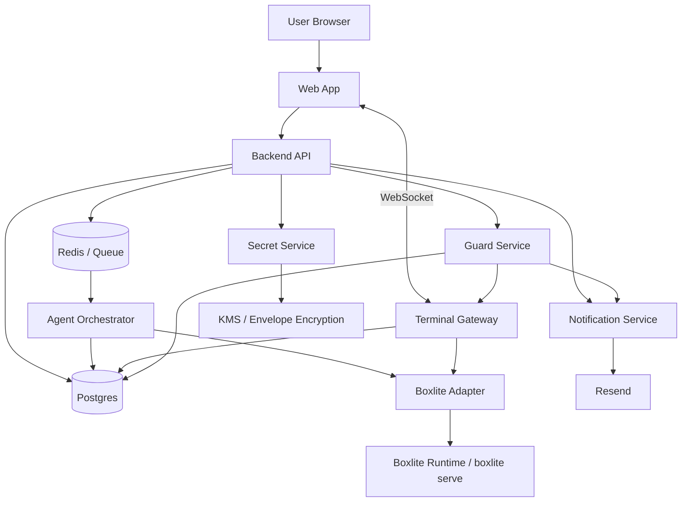

# Agent 运行管理平台设计方案

## 1. 背景与目标

本项目目标是基于 Boxlite 构建一个面向 AI Agent 的运行管理平台。用户可以在 Web 页面选择一个 Agent，例如 `opencode`、`flue`、`droid`，配置自己的 API Key，然后把 Agent 启动到 Boxlite sandbox 中长期运行。用户关闭页面后，Agent 仍然继续执行；用户再次回来时，可以继续查看终端输出、运行状态、历史日志和任务结果。

平台形态可以理解为“面向 Agent 的离线任务平台”，类似传统 Celery、Sidekiq 或 Airflow 的长期任务管理能力，但执行单元不是普通函数，而是运行在隔离 sandbox 中的 Agent 进程和交互式 PTY 会话。

Boxlite 当前能力适合作为底层运行基座：

- 硬件级隔离和 OS sandbox。
- 支持 OCI image、持久 workspace、volume mount、copy-on-write 和 persistent disk。
- 支持 CPU、内存限制、stdout/stderr streaming、metrics。
- 支持 REST API，可通过 `boxlite serve` 暴露 HTTP 服务。
- 支持端口转发，适合 Agent 暴露本地服务或调试 UI。
- 用户补充要求中提到 Boxlite 内置 PTY，可用于 Web 终端场景。

需要注意：Boxlite README 中公开示例包含创建 box 和 exec 命令接口，但 PTY 的具体 REST/WebSocket API 需要后续以 Boxlite 实际文档或源码为准。因此本方案把 Boxlite 调用封装在 `BoxliteAdapter` 中，避免业务系统直接依赖某个未稳定接口。

## 2. 产品能力

平台核心能力包括：

1. Agent 模板市场
   用户从 Agent 模板中选择要运行的 Agent。模板定义 image、启动命令、默认工作目录、资源限制、需要的密钥、环境变量、暴露端口和推荐持久盘策略。

2. 长期运行的 Agent Run
   每次启动 Agent 都生成一个 `agent_run`。它绑定用户、Agent 模板、Boxlite box、启动参数、密钥引用和运行状态。Agent Run 可以在用户离开页面后继续执行。

3. Web Terminal
   前端使用 `xterm.js`，通过 WebSocket 连接平台后端，再由后端连接 Boxlite PTY。用户看到的体验接近真实 terminal，可以输入命令、调整窗口大小、断线重连。

4. 状态与日志持久化
   Agent 的生命周期事件、stdout/stderr、PTY 输出、退出码、错误原因、资源指标都要持久化。用户回来后可以看到最新状态和历史输出。

5. 用户 API Key 管理
   用户可以保存 OpenAI、Anthropic、Gemini、GitHub Token 或 Agent 自定义密钥。密钥加密后存储，运行时按引用注入到 sandbox，不以明文出现在日志和前端。

6. 邮件提醒
   使用 Resend 发送 Agent 运行提醒，例如完成、失败、等待用户输入、长时间无输出、资源异常、费用/额度风险。

7. 离线任务调度能力
   后端需要有类似 Celery 的 worker/reconciler，负责启动、恢复、监控、重试、清理和通知。Web 页面只是观察和控制入口，不承载 Agent 运行生命周期。

8. 值守与自动应答
   当 Agent 频繁询问低风险问题时，平台可以根据用户预设策略代为回答，减少运行中断；重要问题、危险操作或置信度不足时，通过邮件提醒用户处理。

## 3. 总体架构

推荐架构如下：



### 3.1 组件职责

Frontend：

- Agent 模板选择页面。
- Agent Run 创建、启动、停止、重启、删除。
- API Key 管理 UI。
- 运行详情页，包括状态、事件、日志、资源指标、Web Terminal。
- 使用 `xterm.js` 承载终端交互。

Backend API：

- 用户认证和权限校验。
- Agent 模板、Agent Run、Secret、通知配置的 CRUD。
- 创建运行任务并投递到队列。
- 暴露状态查询和控制接口。

Terminal Gateway：

- Browser WebSocket 到 Boxlite PTY 的中转层。
- 处理鉴权、session attach/detach、心跳、窗口 resize、输入输出转发。
- 可选择把 PTY 输出写入日志存储，支持用户回来后回放。

Agent Orchestrator：

- 类似 Celery worker 的核心后台服务。
- 从队列消费启动、停止、重启、恢复、清理任务。
- 调用 Boxlite 创建 box、挂载 volume、启动 Agent 进程。
- 维护 Agent Run 状态机。
- 定期 reconcile DB 状态和 Boxlite 实际状态，处理服务重启后的恢复。

Boxlite Adapter：

- 封装 Boxlite SDK 或 REST API。
- 屏蔽 Boxlite 版本差异。
- 提供 `createBox`、`startPty`、`exec`、`stopBox`、`getMetrics`、`attachPty`、`resizePty`、`deleteBox` 等平台内部接口。

Secret Service：

- 负责密钥加密、解密、授权和审计。
- 运行时只把密钥注入到对应用户的对应 Agent Run。
- 密钥不返回前端，不写入日志。

Notification Service：

- 根据事件规则触发邮件。
- 使用 Resend 发送通知。
- 做去重、限流、模板渲染和失败重试。

Guard Service：

- 监听 Agent 输出中出现的问题、确认提示和等待输入状态。
- 根据用户策略、项目上下文和风险级别判断是否自动应答。
- 只处理低风险、可回滚或用户预先授权的问题。
- 对重要问题、危险操作和低置信度问题触发邮件提醒用户。

## 4. 核心领域模型

### 4.1 Agent Template

Agent Template 是可运行 Agent 的定义，不是一次运行实例。

建议字段：

```text
agent_templates
- id
- slug
- name
- description
- image
- default_command
- default_args
- working_dir
- required_secrets
- optional_env_schema
- default_cpu_limit
- default_memory_limit
- default_disk_size
- exposed_ports
- enabled
- created_at
- updated_at
```

示例：

```text
opencode
- image: ghcr.io/your-org/opencode-agent:latest
- command: opencode
- required_secrets: OPENAI_API_KEY 或 ANTHROPIC_API_KEY
- working_dir: /workspace
```

### 4.2 Agent Run

Agent Run 是用户启动的一次长期运行实例。

```text
agent_runs
- id
- user_id
- agent_template_id
- box_id
- status
- status_reason
- command
- args
- working_dir
- resource_limits
- secret_bindings
- started_at
- stopped_at
- last_heartbeat_at
- last_output_at
- exit_code
- created_at
- updated_at
```

状态建议：

```text
created -> provisioning -> starting -> running -> waiting_input -> completed
                                      -> failed
                                      -> stopping -> stopped
                                      -> lost -> recovering -> running/failed
```

关键约束：

- `agent_run` 是平台状态的权威记录。
- Boxlite 的实际状态需要通过 reconciler 周期性对齐。
- WebSocket 连接状态不能决定 Agent 是否运行。
- 用户离线只意味着 terminal detached，不影响 Agent 进程。

### 4.3 User Secret

```text
user_secrets
- id
- user_id
- name
- provider
- encrypted_value
- encryption_key_id
- last_four
- created_at
- updated_at
- last_used_at
```

`encrypted_value` 使用 envelope encryption。业务数据库只保存密文，解密动作集中在 Secret Service 内部。

### 4.4 Run Event 与日志

```text
agent_run_events
- id
- run_id
- type
- level
- message
- metadata
- created_at
```

```text
agent_run_logs
- id
- run_id
- stream
- sequence
- content
- created_at
```

如果 PTY 输出量很大，建议：

- Postgres 保存索引、最近片段和事件。
- 大日志写入对象存储或日志系统。
- 前端按 sequence 增量拉取。
- WebSocket 在线时实时推送。

## 5. Agent 运行生命周期

### 5.1 创建运行

1. 用户选择 Agent 模板。
2. 用户选择或新建 API Key。
3. 用户配置启动参数、资源限制、持久盘策略。
4. 后端创建 `agent_run`，状态为 `created`。
5. 后端投递 `StartAgentRun` 任务到队列。

### 5.2 启动运行

Orchestrator 消费任务后：

1. 校验用户额度和资源配额。
2. 从 Secret Service 获取运行时密钥。
3. 调用 Boxlite 创建 box。
4. 挂载用户 workspace 或持久 disk。
5. 注入环境变量或 secret mount。
6. 启动 PTY 或 exec 进程。
7. 写入 `box_id`、`pty_session_id`、`pid` 等运行信息。
8. 更新状态为 `running`。

如果 Agent 需要交互式终端，优先通过 PTY 启动主进程；如果只是后台任务，可以通过非交互式 exec 启动，并把 stdout/stderr streaming 到日志。

### 5.3 用户离开页面

用户关闭页面后：

- Browser WebSocket 断开。
- Terminal Gateway detach 当前 PTY 连接。
- Agent 进程继续在 Boxlite box 内运行。
- Orchestrator 继续通过 heartbeat、metrics 和日志流监控。
- 状态变化照常写入数据库并触发通知。

### 5.4 用户回来

用户重新打开运行详情页：

1. 前端查询 `agent_run` 当前状态。
2. 拉取最近日志和事件。
3. 建立 WebSocket。
4. Terminal Gateway 校验权限后 attach 到已有 PTY。
5. xterm.js 恢复 terminal 输出，并继续实时显示。

如果 Boxlite PTY 不支持原生 attach，平台需要在 sandbox 内使用 `tmux` 或类似会话管理器作为兼容层：启动 Agent 时创建 `tmux session`，用户回来时重新 attach。

### 5.5 停止和清理

停止 Agent Run 时：

1. 状态进入 `stopping`。
2. Terminal Gateway 停止接收用户输入。
3. Orchestrator 向 Agent 发送优雅终止信号。
4. 超时后强制 kill。
5. 根据策略保留或删除 Boxlite box、workspace、日志。
6. 状态进入 `stopped`。

## 6. PTY 与 xterm.js 设计

### 6.1 WebSocket 通道

浏览器不直接连接 Boxlite。所有终端流量都经过平台后端，原因是：

- 统一鉴权和审计。
- 避免暴露 Boxlite 内部服务地址。
- 可以过滤敏感输出和控制输入权限。
- 可以做 reconnect、日志持久化、限流。

WebSocket 路径示例：

```text
GET /ws/agent-runs/:runId/terminal
```

连接建立后，消息类型建议：

```text
client -> server
- input: 用户输入
- resize: rows/cols 变化
- ping

server -> client
- output: PTY 输出
- status: run 状态变化
- error: 错误信息
- pong
```

### 6.2 输出回放

xterm.js 本身只维护前端 buffer，页面刷新会丢失。因此平台需要单独保存输出：

- 实时 PTY 输出写入 `agent_run_logs`。
- 前端进入页面时先拉取最近 N 行或最近 N KB。
- WebSocket 建立后从最新 sequence 继续推送。
- 超大日志按时间或 sequence 分页。

### 6.3 多连接策略

同一个 Agent Run 是否允许多个 terminal 同时连接，需要产品上明确。推荐 MVP 阶段：

- 允许多个只读观察连接。
- 同一时间只允许一个可输入连接。
- 后连接者可以申请接管输入权限。

这样可以避免两个页面同时输入导致 Agent 状态混乱。

### 6.4 值守与自动应答

一些 Agent 在长期运行时会频繁询问确认问题，例如是否继续、选择默认方案、是否安装依赖、是否接受低风险修改。为了让 Agent 能持续运行，平台可以提供一个 Guard Service 做“值守”。

值守流程：

1. Terminal Gateway 将 PTY 输出写入日志，同时把疑似问题事件发送给 Guard Service。
2. Guard Service 识别问题类型、风险级别和可自动回答程度。
3. 如果命中用户预设规则，Guard Service 通过 Terminal Gateway 向 PTY 写入回答。
4. 如果问题重要、涉及不可逆操作、权限扩大、费用风险或置信度不足，则不自动回答，改为触发邮件提醒用户。
5. 所有自动应答都记录到事件日志，便于用户回来后审计。

用户可配置的策略包括：

- 是否启用值守。
- 默认偏好，例如优先选择安全方案、默认不删除文件、默认不执行付费操作。
- 允许自动回答的问题类型，例如继续执行、安装常规依赖、选择默认选项。
- 禁止自动回答的问题类型，例如删除数据、提交代码、推送远端、购买服务、暴露密钥、修改账单配置。
- 单次运行的最大自动应答次数，避免 Agent 陷入循环。

Guard Service 不应绕过终端输入权限控制。自动应答本质上也是向 Agent Run 写入输入，因此必须经过权限校验、审计和限流。

## 7. API Key 与密钥持久化

用户密钥需要持久化，但不能以明文保存。

推荐策略：

1. 用户创建 Secret 时，前端通过 HTTPS 提交明文一次。
2. Backend API 立即交给 Secret Service 加密。
3. 数据库只保存密文、provider、name、last_four。
4. 前端只能看到脱敏信息，不能读回明文。
5. Agent Run 只保存 secret 引用，不保存 secret 明文。
6. 启动 Agent 时，Orchestrator 按权限临时解密并注入 sandbox。
7. 日志系统对常见 key pattern 做 redaction。

密钥注入方式按优先级：

1. 运行时环境变量，适合大多数 CLI Agent。
2. 临时 secret file mount，适合多行配置或 JSON key。
3. Agent 专用 config 文件，但需要确保文件权限和清理策略。

不建议把用户 API Key 写入持久 workspace，除非 Agent 本身强依赖本地配置文件，并且用户明确授权。

## 8. 通知系统与 Resend

通知不应直接由 Orchestrator 发送邮件，而应由 Notification Service 消费事件后发送，避免运行逻辑和通知逻辑耦合。

事件来源：

- Agent Run 状态变化。
- Agent 输出中检测到等待用户输入。
- Guard Service 识别到重要问题或无法自动回答的问题。
- Agent 完成或失败。
- 长时间无输出。
- 资源使用超过阈值。
- Boxlite box 异常退出。

通知规则示例：

```text
notification_rules
- id
- user_id
- event_type
- enabled
- channel: email
- target_email
- min_interval_seconds
- created_at
- updated_at
```

Resend 发送策略：

- 每类事件做 debounce，避免刷屏。
- 失败后指数退避重试。
- 邮件内包含 Agent 名称、运行状态、最近摘要和回到运行详情页的链接。
- 对等待用户决策的问题，邮件内只放问题摘要和处理入口，不直接暴露完整终端内容。
- 不在邮件里包含密钥、完整日志或敏感输出。

## 9. 后端 API 草案

用户与 Agent：

```text
GET    /api/agent-templates
GET    /api/agent-templates/:id
POST   /api/agent-runs
GET    /api/agent-runs
GET    /api/agent-runs/:id
POST   /api/agent-runs/:id/stop
POST   /api/agent-runs/:id/restart
DELETE /api/agent-runs/:id
```

日志与事件：

```text
GET /api/agent-runs/:id/events
GET /api/agent-runs/:id/logs?after=<sequence>
GET /api/agent-runs/:id/metrics
```

密钥：

```text
GET    /api/secrets
POST   /api/secrets
PATCH  /api/secrets/:id
DELETE /api/secrets/:id
```

通知：

```text
GET   /api/notification-rules
POST  /api/notification-rules
PATCH /api/notification-rules/:id
```

终端：

```text
GET /ws/agent-runs/:id/terminal
```

## 10. Boxlite 集成边界

平台内部不要在业务代码中散落 Boxlite API 调用，应统一由 `BoxliteAdapter` 负责。

建议接口：

```text
BoxliteAdapter.createBox(options) -> boxId
BoxliteAdapter.startExec(boxId, command, options) -> execId
BoxliteAdapter.startPty(boxId, command, options) -> ptySessionId
BoxliteAdapter.attachPty(boxId, ptySessionId) -> stream
BoxliteAdapter.resizePty(boxId, ptySessionId, cols, rows)
BoxliteAdapter.stopProcess(boxId, processId)
BoxliteAdapter.getBoxStatus(boxId)
BoxliteAdapter.getMetrics(boxId)
BoxliteAdapter.stopBox(boxId)
BoxliteAdapter.deleteBox(boxId)
```

已从 Boxlite README 确认的 REST 示例：

```text
POST /v1/default/boxes
POST /v1/default/boxes/:boxId/exec
```

待确认的 Boxlite 能力：

- PTY 创建接口。
- PTY attach/reconnect 语义。
- PTY resize 接口。
- box 停止后持久盘恢复方式。
- 日志 streaming 的稳定 API。
- metrics API 字段。
- 端口转发 API。

如果 Boxlite 原生 PTY attach 能力不足，MVP 可以通过 `tmux` 兼容：Boxlite 只负责 exec 一个 `tmux new-session`，Terminal Gateway 连接时再 attach 到同一个 session。

## 11. 持久运行与恢复机制

长期运行平台最关键的是“页面不在线，任务仍然可靠”。因此需要 reconciler。

Reconciler 周期性执行：

1. 扫描状态为 `starting`、`running`、`stopping`、`recovering` 的 Agent Run。
2. 查询 Boxlite 中 box 和进程的真实状态。
3. 如果 DB 显示 running，但 box 不存在，标记为 `lost` 或按策略重建。
4. 如果进程退出，记录 exit code，并进入 `completed` 或 `failed`。
5. 如果长时间无 heartbeat，触发恢复或通知。
6. 如果 Orchestrator 重启，从 DB 重新加载未完成运行。

推荐把 Agent Run 启动设计为幂等操作：

- `StartAgentRun` 重复执行不会创建多个 box。
- 已有 `box_id` 时优先检查现有 box。
- 状态变更使用乐观锁或事务，避免并发 worker 重复处理。

## 12. 资源、租户与安全

多用户平台必须默认不信任用户输入和 Agent 行为。

安全策略：

- 每个 Agent Run 独立 box。
- 严格 CPU、内存、磁盘、运行时长配额。
- 默认不允许访问平台内网和元数据服务。
- 出网策略可配置，必要时按域名或端口限制。
- 用户密钥只注入用户自己的运行实例。
- 日志 redaction，避免泄漏 API Key。
- 所有控制接口做 owner 校验。
- Terminal Gateway 做输入速率限制和最大连接数限制。
- Boxlite host 与 Web/API 服务网络隔离。
- 删除 Agent Run 时明确区分删除运行记录、删除日志、删除持久盘。

## 13. 推荐技术选型

由于当前仓库还没有既有技术栈，推荐从以下组合开始：

- Frontend：Next.js + React + xterm.js。
- Backend API：Next.js API Route、NestJS 或 FastAPI 均可；如果团队偏 TypeScript，优先 NestJS。
- Worker/Queue：Redis + BullMQ，MVP 简单；后续复杂工作流可迁移 Temporal。
- Database：Postgres。
- Secret Encryption：云 KMS 或自托管 master key + envelope encryption。
- Email：Resend。
- Logs：MVP 存 Postgres；日志量增长后迁移对象存储或 ClickHouse/Loki。
- Runtime：Boxlite REST API 或 SDK。

如果目标是尽快验证产品，MVP 可以用单体服务加一个 worker 进程：

```text
web: Next.js frontend + API
worker: Agent Orchestrator + Notification worker
postgres: metadata
redis: queue/websocket pubsub
boxlite: sandbox runtime
```

## 14. MVP 分阶段计划

### Phase 1：单用户可运行闭环

- 固定 1 到 2 个 Agent 模板。
- 用户保存 API Key。
- 创建 Agent Run。
- Boxlite 中启动 Agent。
- xterm.js 连接 PTY。
- 页面关闭后 Agent 继续运行。
- 回到页面可继续查看 terminal。

### Phase 2：持久化和通知

- Agent Run 状态机。
- 日志和事件持久化。
- Resend 邮件通知。
- Reconciler 恢复机制。
- 基础资源限制和配额。

### Phase 3：多用户与生产化

- 多租户权限隔离。
- Secret Service 完整审计。
- 多 Boxlite host 调度。
- 资源计量和计费。
- Agent 模板市场。
- 团队协作和只读观察终端。

### Phase 4：高级 Agent 运维

- Snapshot 和回滚。
- Agent 运行策略编排。
- Webhook 通知。
- 自动摘要 Agent 运行结果。
- 失败诊断和自动重试建议。

## 15. 关键风险与应对

1. PTY attach 语义不明确
   优先确认 Boxlite 原生 PTY API。如果不支持稳定 attach，用 `tmux` 作为 Agent 会话层。

2. 用户密钥泄漏
   使用加密存储、运行时注入、日志脱敏、权限校验和审计。不要把 key 写进 workspace。

3. Agent 长期运行导致资源不可控
   引入 quota、超时、空闲检测、最大磁盘限制、出网限制和人工 kill 能力。

4. 页面终端和后台运行状态耦合
   明确 WebSocket 只是观察和输入通道，Agent Run 生命周期由 Orchestrator 管理。

5. Boxlite host 故障
   Reconciler 标记 run 为 `lost`，根据持久盘和 snapshot 策略恢复或提示用户。

6. 日志量过大
   MVP 限制日志大小，后续将完整日志迁移到对象存储或日志系统，Postgres 只保留索引和最近片段。

## 16. 下一步建议

优先验证一条最小技术链路：

1. 启动 `boxlite serve`。
2. 创建一个 box。
3. 在 box 中通过 PTY 或 `tmux` 启动一个简单 Agent 命令。
4. 用后端 WebSocket 转发到 xterm.js。
5. 断开浏览器后确认进程仍在运行。
6. 重新打开页面后重新 attach 并看到连续输出。

这条链路验证通过后，再补数据库、Secret、通知和多用户权限。否则过早设计复杂任务系统，可能会被 PTY attach、box 生命周期或持久盘语义卡住。
